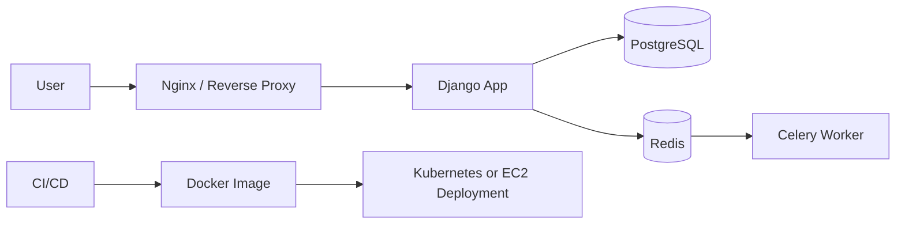
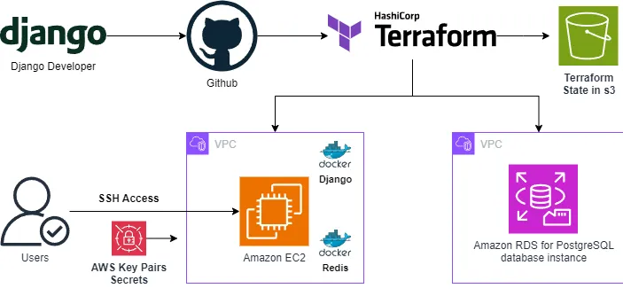
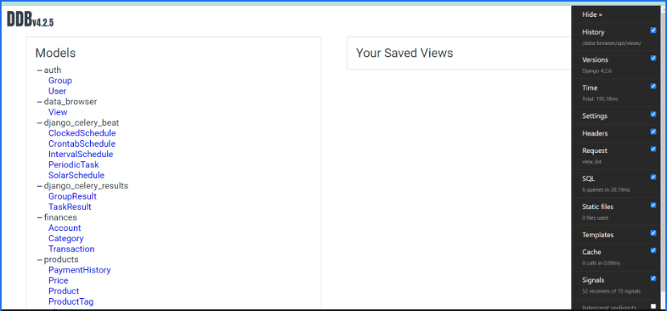

# Django SaaS E-Commerce DevOps Platform

> **Stage 5 of 12 — Career Progression Project**  
> Portfolio project by **Yugandhar Ethamukkala**.

Full-stack Django SaaS/e-commerce application packaged with Docker, Docker Compose, Kubernetes deployment files, tests, and AWS deployment automation.

## Career Progression Story

Application platform step: I worked on a larger real-world style application with database, Docker, Kubernetes, and AWS deployment assets.

This repo is part of my 12-project DevOps portfolio path. The goal is to show steady growth from CI/CD foundations into AWS cloud, Kubernetes, GitOps, observability, DevSecOps, progressive delivery, and AI-enabled deployments.

## What This Project Demonstrates

- Shows application platform engineering, not only infrastructure scripts.
- Includes realistic runtime concerns such as environment variables, database migrations, static assets, and health checks.
- Good project for explaining how DevOps supports developers and production readiness.

## Tech Stack

`Python` `Django` `PostgreSQL` `Redis` `Celery` `Docker` `Docker Compose` `Kubernetes` `AWS` `GitHub Actions`

## Architecture



## Repository Structure

```text
.
├── .dockerignore
├── .env.example
├── .terraformignore
├── Dockerfile
├── Makefile
├── Procfile
├── README.md
├── REPO_UPLOAD_CHECKLIST.md
├── apps/
├── autoPull.sh
├── autoPush.sh
├── database.ini
├── deployment.yaml
├── deployments/
├── docker-compose-nginx.yaml
├── docker-compose.yml
├── docs/
├── gunicorn_config.py
└── ...
```

## Prerequisites

- Git
- Docker where containers are used
- Cloud CLI/tools only when deploying cloud resources
- `kubectl`, `kind`, `terraform`, `sam`, `maven`, `npm`, or `python` depending on the project
- Never commit real `.env` files, API keys, access keys, kubeconfigs, private keys, or tokens

## Local Run

```bash
cp .env.example .env
docker compose up --build
open http://127.0.0.1:8585/
```

## Validation Before GitHub Upload

Run these checks before pushing major changes:

```bash
cp .env.example .env
make check
docker compose config --quiet
python manage.py test tests.test_healthcheck --noinput
```

## Deployment Overview

1. Review .env values and keep real secrets in a secret manager.
2. Build and push the Docker image to your registry.
3. Apply Kubernetes manifests or use the AWS deployment scripts after updating variables.
4. Run database migrations and verify the health endpoint before exposing traffic.

## Screenshots

The project already included these snapshots, so I added them into the README. Replace them with your own latest run screenshots when you execute the lab.

### Application homepage



### Application product/page view



## Cleanup / Cost Control

Run cleanup commands after testing so cloud resources do not keep charging:

```bash
docker compose down -v
kubectl delete -f deployment.yaml --ignore-not-found=true
terraform destroy -auto-approve # run only from the Terraform folder you used
```

## Security Notes

- Use GitHub Actions OIDC, Jenkins credentials, AWS Secrets Manager, Vault, or Kubernetes Secrets instead of hard-coded keys.
- Keep `.env` files local and commit only `.env.example` with safe placeholders.
- Review Terraform plans before apply/destroy.
- Do not publish account IDs, private IPs, public IPs from your lab, billing pages, or credential screenshots.

## How I Would Explain This in an Interview

I built this project as part of my DevOps portfolio to show hands-on experience with the tools used in real delivery environments. The focus is not only on writing code, but also on creating a repeatable workflow for build, validation, deployment, security, monitoring, and cleanup.

In a real project, I would connect this type of setup with environment-specific variables, approval gates, secrets management, monitoring dashboards, and rollback steps so teams can release safely and troubleshoot faster.

---

<p align="center">
  
</p>

<h2 align="center">🤝 Connect With Me</h2>

<p align="center">
  <em>
    Thanks for visiting this project! I’m continuously building hands-on DevOps, Cloud, Automation, and AI-enabled engineering projects to improve real-world deployment, monitoring, and infrastructure skills.
  </em>
</p>

<p align="center">
  
</p>

<p align="center">
  <a href="https://github.com/yugandhar99" target="_blank" rel="noopener noreferrer">
    
  </a>
  <a href="https://www.linkedin.com/in/yugandhar-devops" target="_blank" rel="noopener noreferrer">
    
  </a>
  <a href="https://yugandhar-portfolio-psi.vercel.app/" target="_blank" rel="noopener noreferrer">
    
  </a>
  <a href="mailto:yugandharethamukkala1999@gmail.com">
    
  </a>
</p>

<p align="center">
  
  
  
  
</p>

---

<p align="center">
  ⭐ If this project added value, feel free to star the repository and connect with me!
</p>

<p align="center">
  <strong>Built with ❤️ using modern DevOps practices</strong>
</p>

